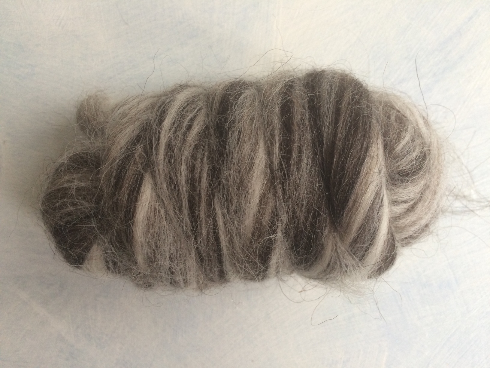

My pandemic lockdown preparation started quite early. I got the gut feeling in September and started to get ready to be at home more than ever (as if the home office from March was not enough). In order to keep my sanity I had to stock up with projects. So I got a nice delivery from World of wool with a lot of samples and started to give them purpose. This is the first sample from Humbug series.

Humbug wools are blends from one type of sheep wools. There are 7 blends like this, only natural colours, for a very fair price. But I needed to kow how the fibre feels ad works before ordering larger amount. So I got the samples and I started spinning the first one, Icelandic. Or at least that is what it is. I compared the pictures from WoW website with the sample and shot from the hip :)

Each sample has 50g of wool, that is a doable amount for playing. I started examining the fibre, it has a quite long staple, it is quite coarse to touch. My mind was starting to imagine icelandic landscapes and cold weather and I saw myself in a coat. Yeah, it doesn't feel like somthing I would like to wear on my skin, but it would make some heavy duty protection against wet and cold weather if woven into a good fabric. The blend comes out a bit 'salt and pepper' like shades, medium grey, I can definitely imagine a good woolen duffle coat. Stop dreaming and spin on, girl...

