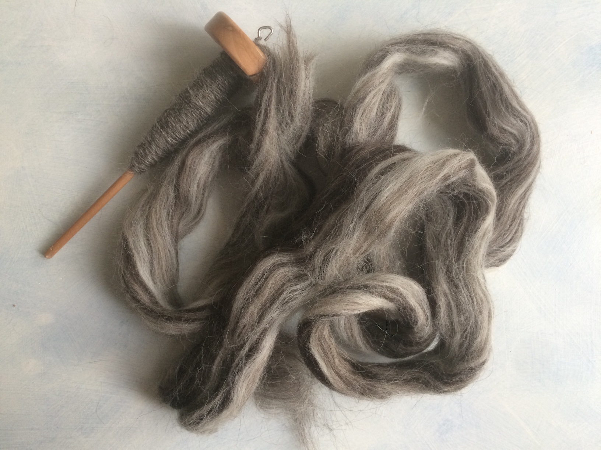
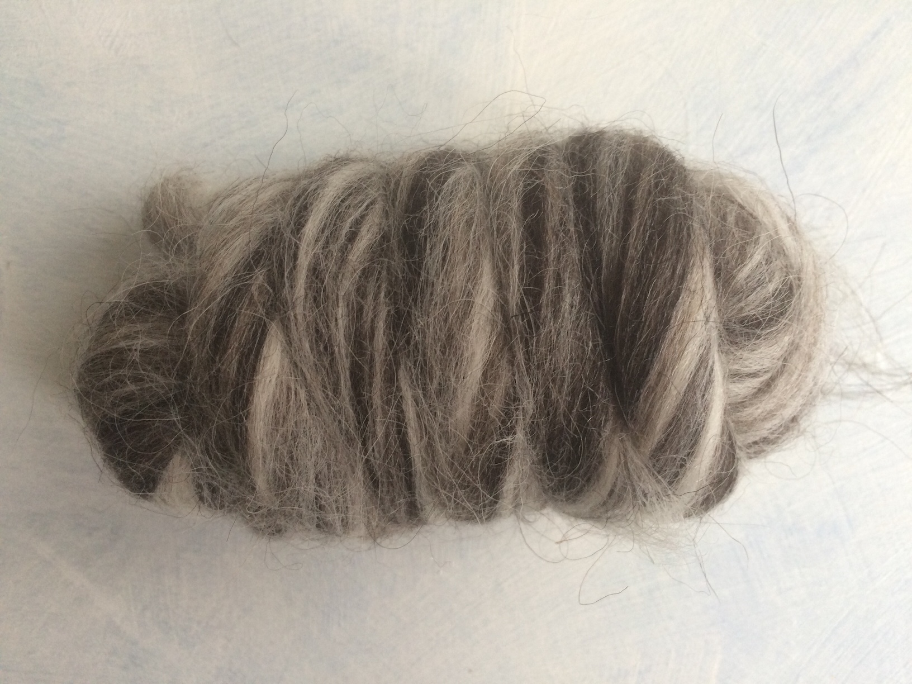
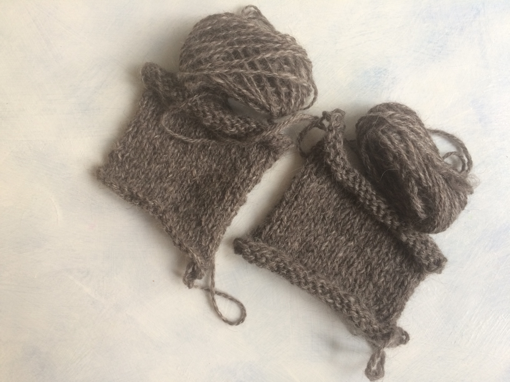

My pandemic lockdown preparation started quite early. I got the gut feeling in September and started to get ready to be at home more than ever (as if the home office from March was not enough). In order to keep my sanity, I had to stock up with projects. So I got a nice delivery from World of wool with a lot of samples and started to give them some purpose. This is the first sample from the Humbug series.

Humbug wools are blends from one type of sheep wools. There are 7 blends from arious sheep breeds, only natural colors, for a very fair price. But I needed to know how the fiber feels and works before ordering a larger amount. So I got the samples and I started spinning the first one, Icelandic. Or at least that is what I think it is. I compared the pictures from the WoW website with the sample and shot from the hip :)

Each sample has 50g of wool, that is a doable amount for playing. I started examining the fiber, it has a quite long-staple, it is quite coarse to touch. My mind was starting to imagine Icelandic landscapes and cold weather and I saw myself in a coat. Yeah, it doesn't feel like something I would like to wear on my skin, but it would make some heavy-duty protection against wet and cold weather if woven into a piece of good fabric. The blend comes out a bit 'salt and pepper' like shades, medium grey, I can definitely imagine a good woolen duffle coat. Stop dreaming and spin on, girl...

So when spun into a 2ply and a 3ply samples, the shades of white to grey blended a bit too much to my liking and the finished yarn is just mostly medium grey. Also, standard thickness and plying produce standard yarns. Next time I will try slightly more experimenting with the roving.

The finished samples in 2-ply and 3-ply are nearly identical. The final fabric is kind of wiggly, not too coarse but not something to touch sensitive skin. I will need to find a good idea of how to use this yarn for a product.
