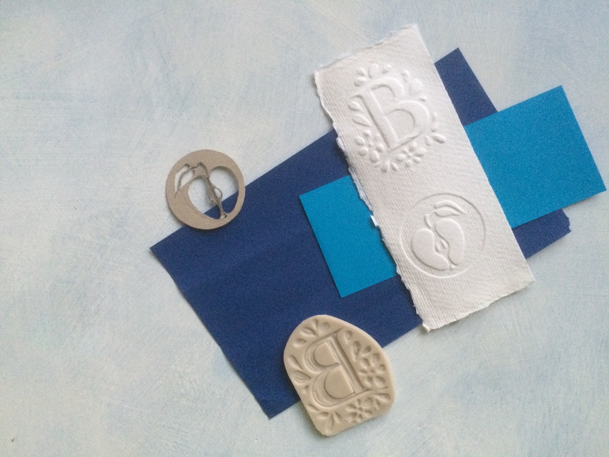
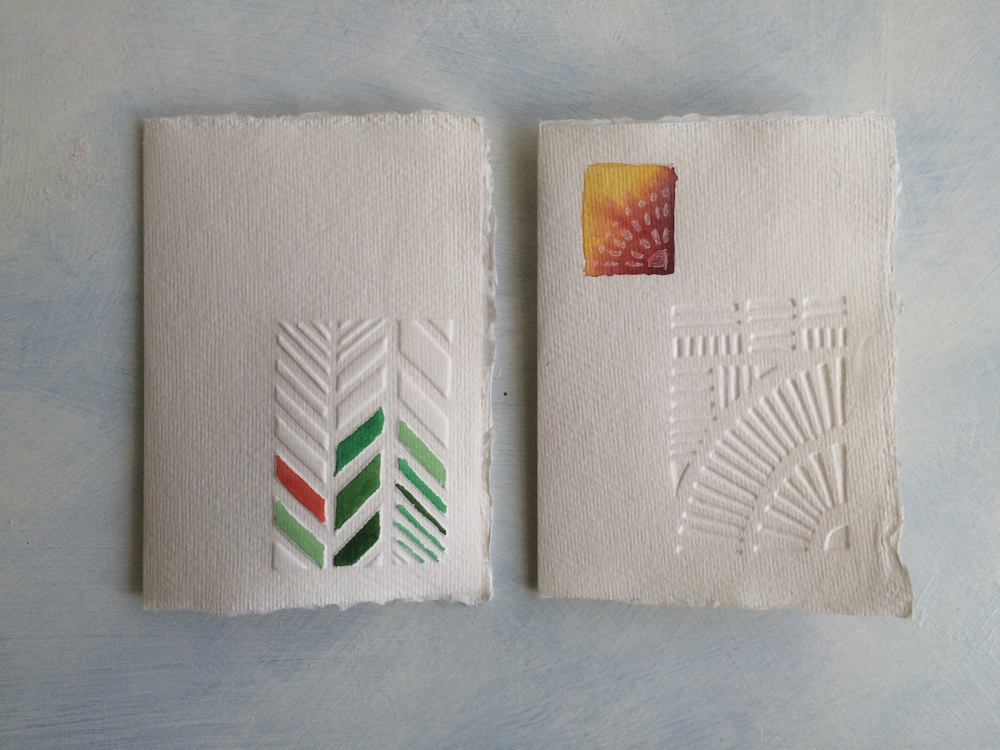
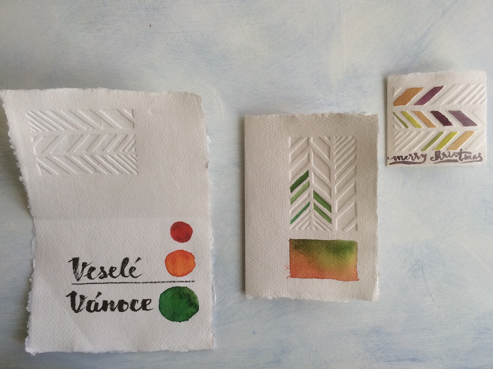
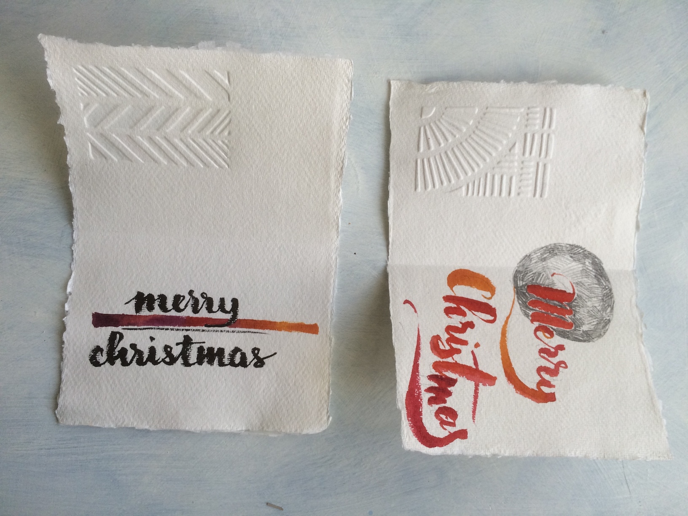
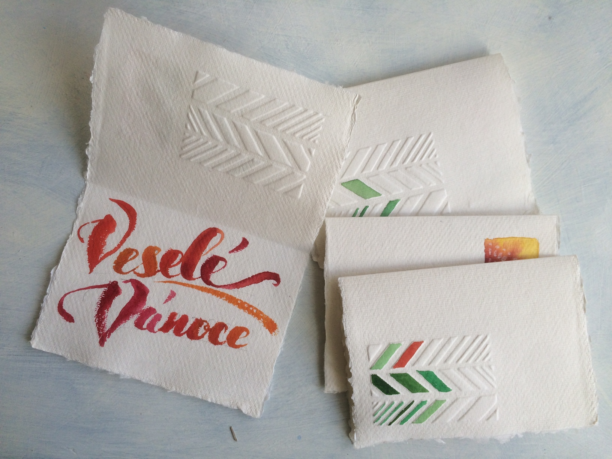

Short articles, good articles!

I wanted to try something new with paper and I had the idea to create some Christmas cards. So a bit of learning something new and creating something useful I can give away.

...
Long Pinterest browsing
...
Long YouTube browsing
...

I tried the linocut material at first - I had some scrap pieces and I already have the carving tools from the past when I thought I could make living out of printing textiles. I carved letter B. Just Because. The carving process was easy, but I made the letters a bit too deep, so when I made my first try using a piece of Khadi paper I ripped the paper. I used an aluminum crochet hook, it has a nice smooth surface. But the depth wasn't right. For the second try, I recycled the back cardboard from a sketchbook and the depth was just right - it cut easily, it was deep enough to be visible on the paper but shallow enough not to suffer any damage. I made a halved apple.

After the initial success, I started to create the cards. It was more experimenting than a precise process, so the writing (my so-called calligraphy) was a bit off, colors were put wherever and most of it was done without any intention while watching a movie. But the result is quite nice and I can build on that experience.
I later tried other paper qualities too, but so far I am in love with Khadi paper. These can be bought as separate sheets of various sizes, it's recycled material and it has uneven edges and coarse structure. It shapes pretty easily and the embossed shapes are jumping out of it.

I didn't have a good idea for an image, so I made two graphical images - one made of strokes creating a circular shape and uneven chevron. Chevron, I later found, hides a tree inside.

Now I need more paper, ideas, concept, designs, and the government needs to reopen the art supplies shops because I am out of Khadi paper.
